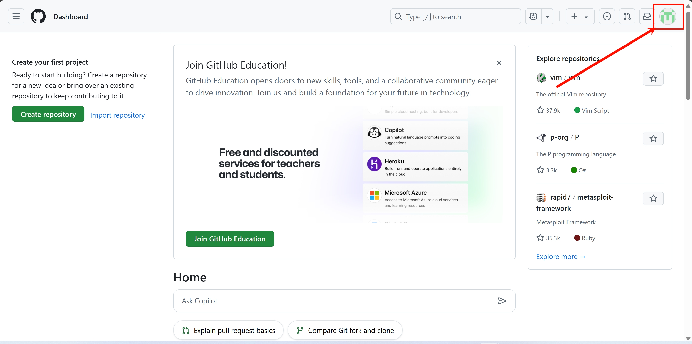
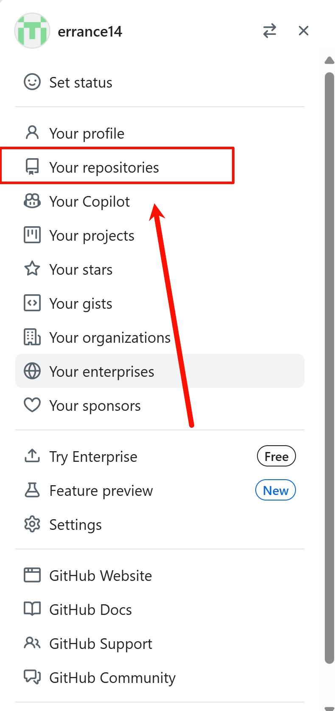
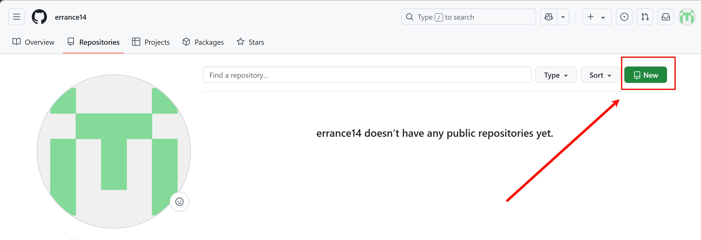
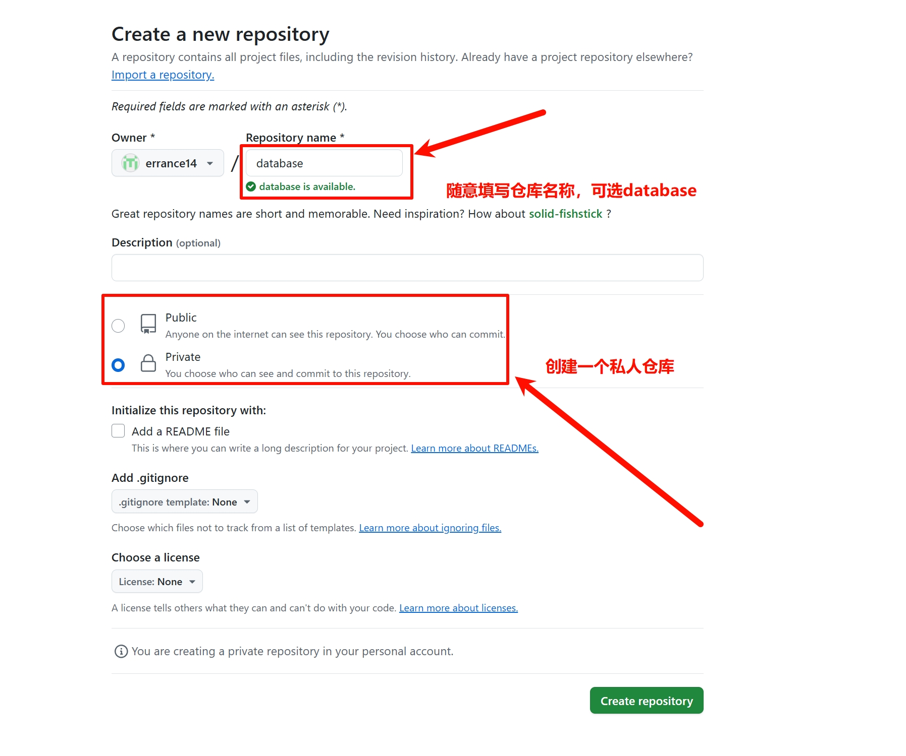
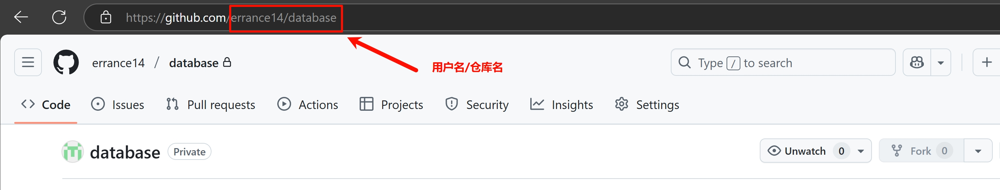
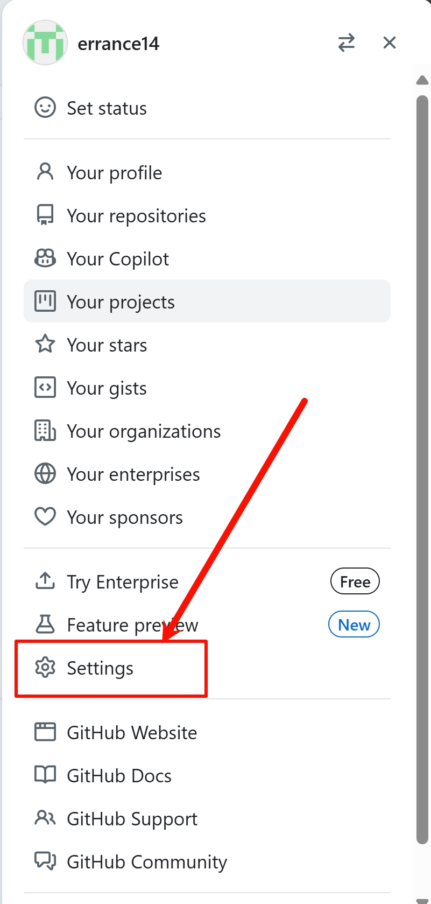
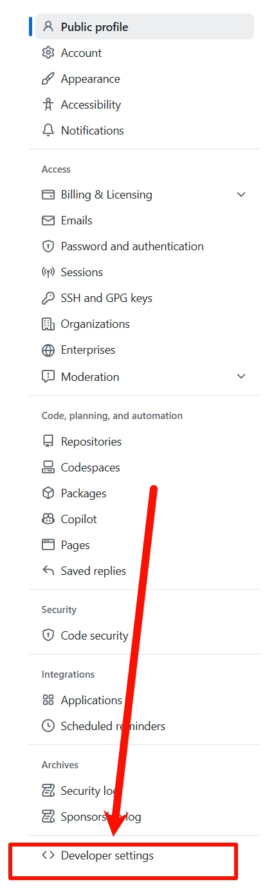
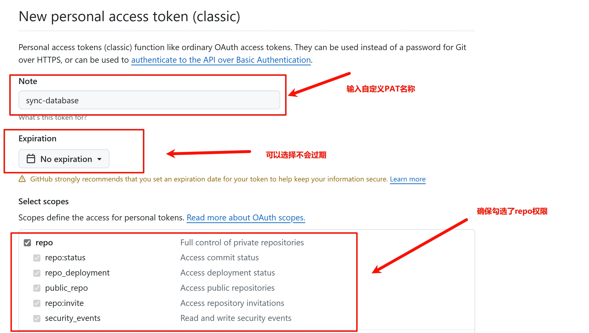
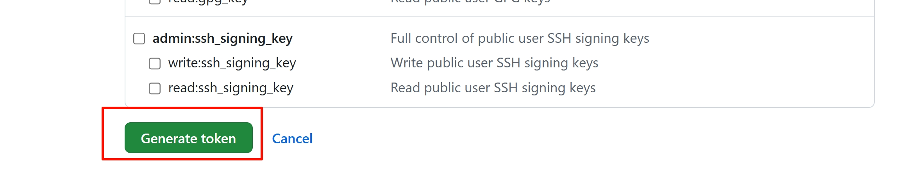
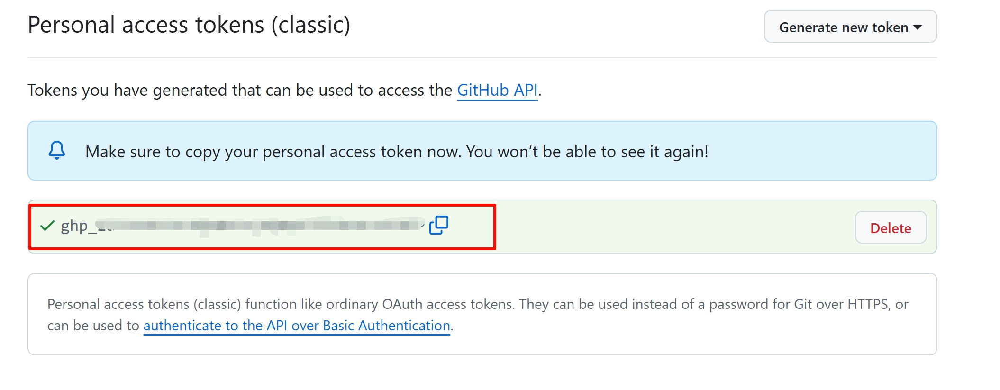

# GitHub 同步功能

gemini proxy panel 支持 GitHub 同步数据库功能，这个功能可以自动将数据库上传至您的私人 GitHub 仓库，并且在每次启动时自动下载最新的数据库，以保证数据的持久化存储。

**注意：** 在不支持持久化数据的平台（例如 Hugging Face Space）部署时，必须启用此功能。

## 创建数据库仓库

1.  首先，来到 GitHub 后台，点击右上角的头像打开右侧边栏。

    

2.  点击 `Your repositories` 打开 repo 界面。

    

3.  点击 `New` 新建一个仓库。

    

4.  在 `Repository name` 处填写一个自定义名称，并且选择 `Private` 创建一个私人仓库，最后点击 `Create repository` 完成创建。

    

5.  在 repo 界面找到刚刚创建的仓库，点击打开，在 URL 栏复制后缀 `用户名/仓库名`，这将作为环境变量 `GITHUB_PROJECT` 使用。

    

## 创建 PAT 密钥

1.  在 GitHub 后台，点击右上角的头像打开的右侧边栏中点击 `Settings`。

    

2.  在新打开的左侧边栏中的最下方点击 `Developer settings`。

    

3.  选择 `Personal access tokens` 中的 `Tokens (classic)` 选项，并在右侧的页面中选择 `Generate new token` 并点击 `Generate new token (classic)`。

    

4.  在新打开的页面中随意填写一个 `Note` 为 PAT 命名，并且在下方的权限选择区域中确保选中 `repo` 权限。可以设置让 PAT 不会过期。

    

5.  点击 `Generate token` 创建 PAT 密钥。

    

6.  在弹出的页面中记录 PAT 密钥，这将作为环境变量 `GITHUB_PROJECT_PAT` 使用。

    

## 启用 GitHub 同步功能

在环境变量中正确配置上面步骤中获取的 `GITHUB_PROJECT`、`GITHUB_PROJECT_PAT` 即可启用 GitHub 同步功能。

并且出于安全考虑，强烈建议启用数据库加密功能。数据库加密功能将使用 AES-256-CBC 加密算法实现对上传的数据库进行加密，在不泄露密钥的情况下基本可保证数据的安全不被破解。

### 启用加密功能

在环境变量中添加变量 `GITHUB_ENCRYPT_KEY`，并配置一个最少 32 位的密钥以启用加密功能，建议使用[密码生成工具](https://1password.com/zh-cn/password-generator)生成。

> **注意：** 如果您希望后续重置部署，或使用其他的部署时保持现有的数据，请在本地妥善保存以上使用到的环境变量。