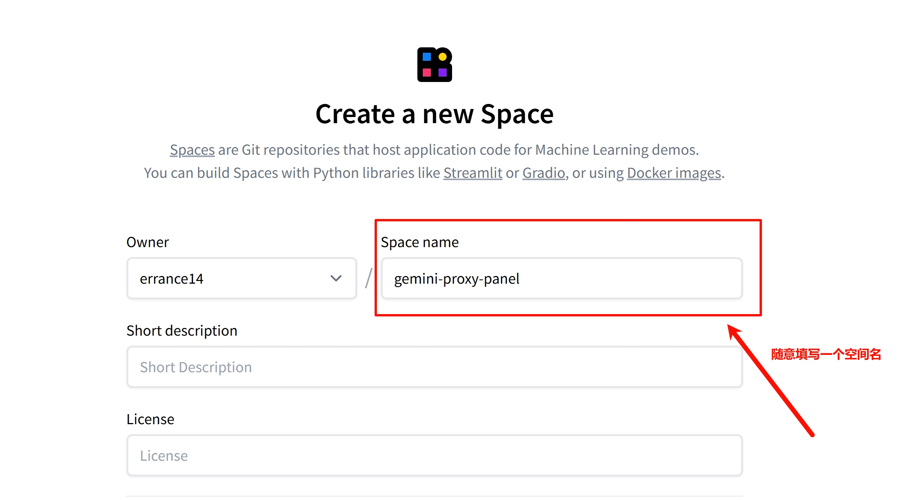
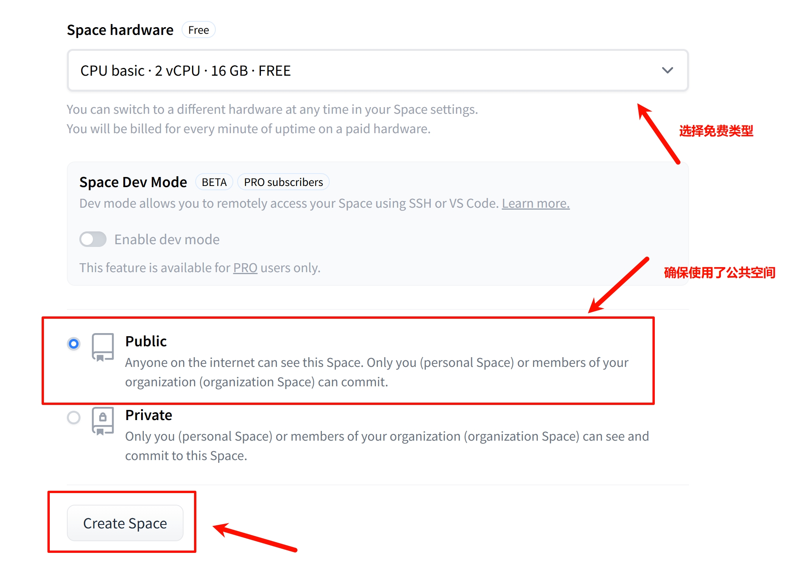
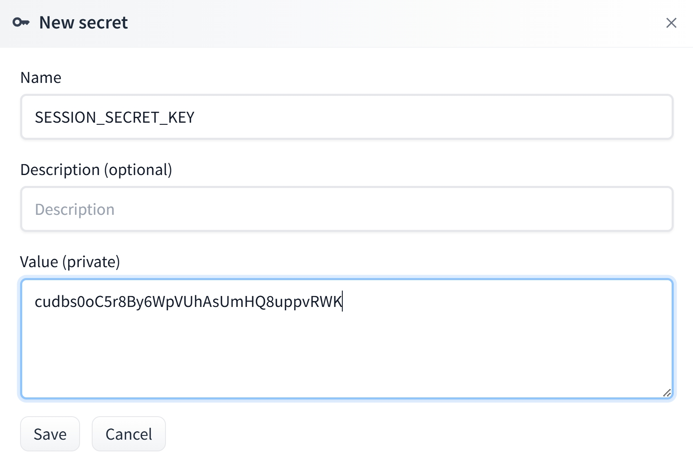
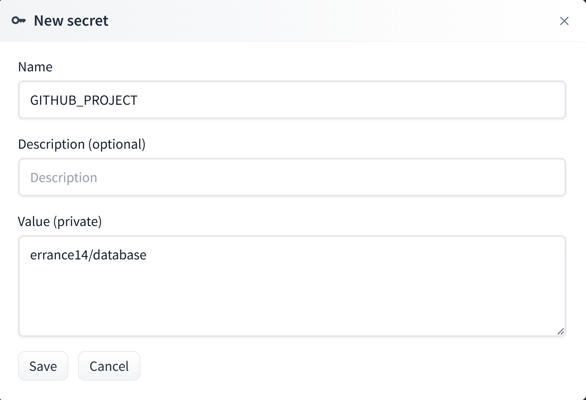
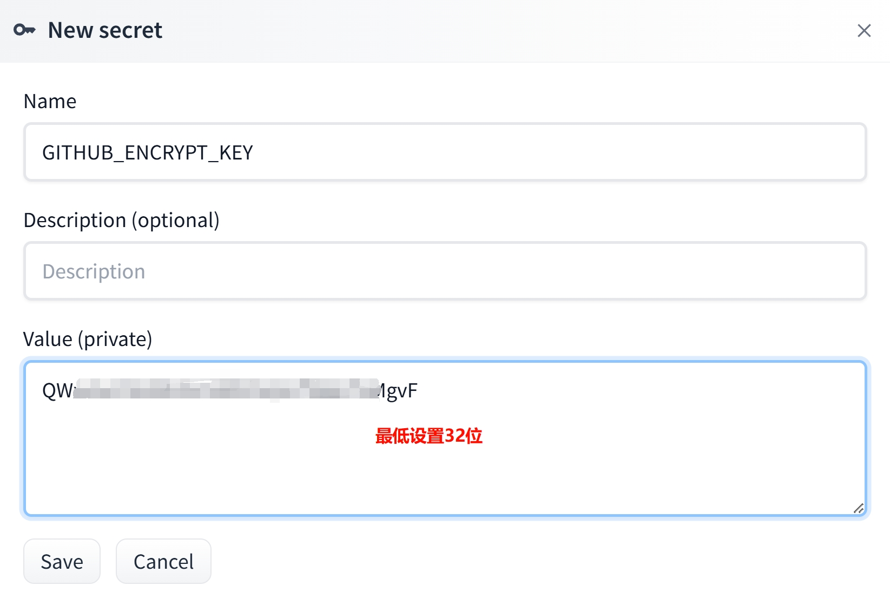
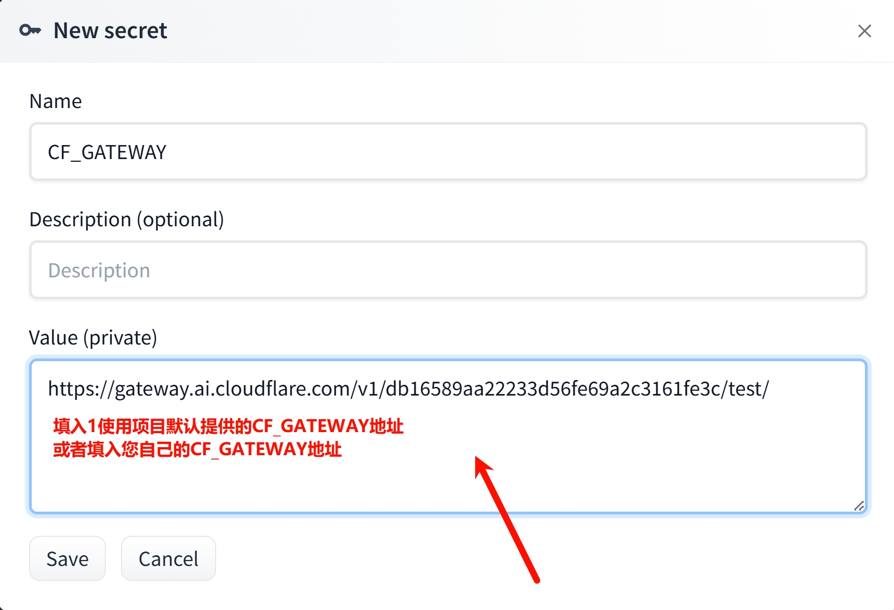
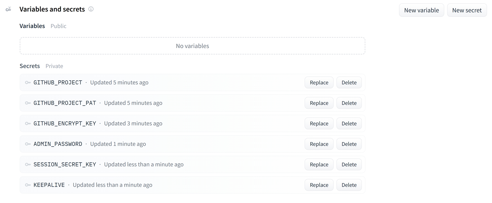
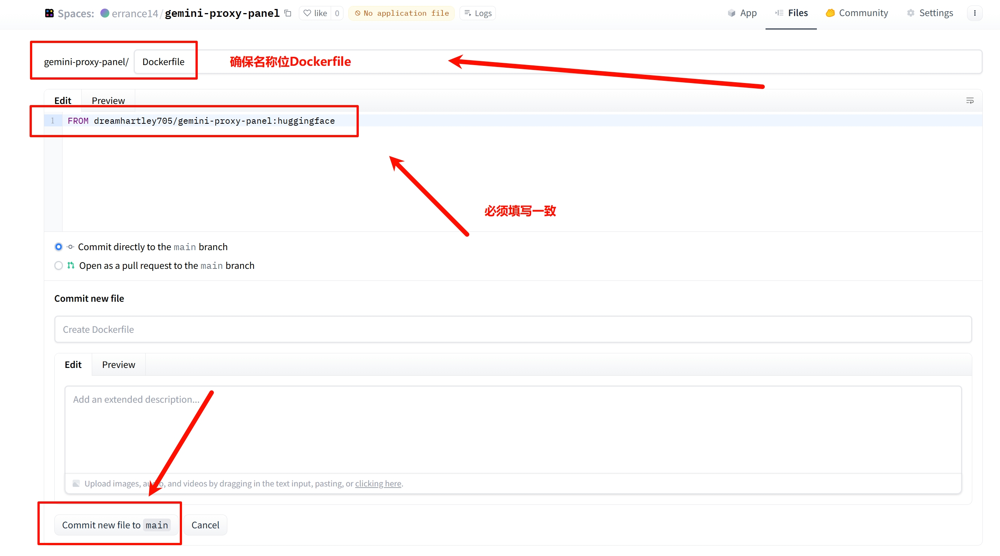
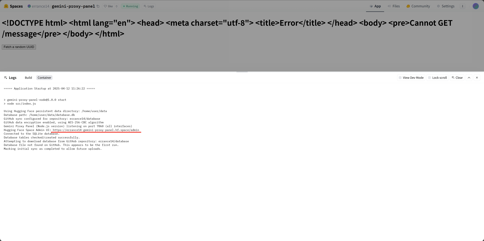

# Hugging Face Space 部署

此部署方式利用 Hugging Face Space 的 Docker 环境运行，并**强制要求启用 GitHub 同步**功能以实现数据持久化。

1. **准备 GitHub 仓库和 PAT**:
   
   * 你需要一个**自己的** GitHub 仓库来存储同步的数据。建议使用私有仓库。
   * 创建一个 GitHub Personal Access Token (PAT)，并确保勾选了 `repo` 权限范围。**请妥善保管此 Token**。
   * 具体操作步骤详见[GitHub配置同步教程](../GitHub/GitHub同步.md)
2. **创建 Hugging Face Space**:
   
   * 访问 Hugging Face Space 页面，点击新建一个 Space。\
   
   * 在`Space name`处随意填写一个名称，例如`gemini-proxy-panel`\
   
   * 选择 "Docker" 作为 Space SDK。\
   
   * 确保选择的免费的配置类型，并且设置空间为公开。最后点击`Create Space`。\
   
3. **配置 Space Secrets**:
   
   * 进入你创建的 Space 的 "Settings" -> "Repository secrets"。\
   
   
   * 添加以下 Secrets：
     * `ADMIN_PASSWORD`: 设置管理面板的登录密码。\
     
     * `SESSION_SECRET_KEY`: 设置一个长且随机的会话密钥。\
     
     * `GITHUB_PROJECT`: 填入你**自己的** GitHub 仓库路径，格式为 `your-username/your-repo-name`。\
     
     * `GITHUB_PROJECT_PAT`: 填入你创建的 GitHub PAT。\
     
     * `GITHUB_ENCRYPT_KEY`: 设置一个用于加密同步数据的密钥，**必须是 32 位或更长的字符串**。\
     
     * (可选)`KEEPALIVE`: 填入`1`启用心跳机制，以实现假流式传输。\
     详情参考: [KEEPALIVE模式介绍](../../Usage/KEEPALIVE.md)\
     
     * (可选)`CF_GAGEWAY`: 填入`1`启用脚本默认提供的Cloudflare AI Gateway网关转发请求，或输入您自己网关链接。\
     详情参考: [CF_GATEWAY介绍](../../Usage/CF_GATEWAY.md)\
     
     * Secrets配置完成。\
     

4. **创建 Dockerfile**:
   
   * 在 Hugging Face Space 的 "Files" 标签页中，点击 "Add file" -> "Create new file"。\
   
   * 将文件名设置为 `Dockerfile`。
   * 将以下内容粘贴到文件中：
     ```dockerfile
     FROM dreamhartley705/gemini-proxy-panel:huggingface
     ```
   * 点击 "Commit new file"。
   
5. **启动和访问**:
   
   * Hugging Face Space 会自动使用此 `Dockerfile` 构建并启动应用。
   * 应用启动后，会使用你配置的 Secrets 连接到你的 GitHub 仓库进行数据同步。
   * 点击查看 Log 会自动显示后台UI地址。\
   

6. **在后台中进行设置**
   
   * 在后台UI中进行配置 Api 连接，详细请参考[配置API连接教程](../../Usage/配置API连接.md)
