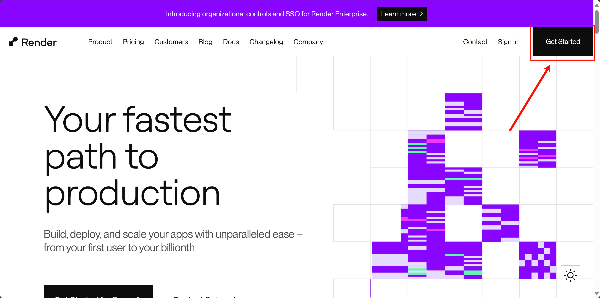
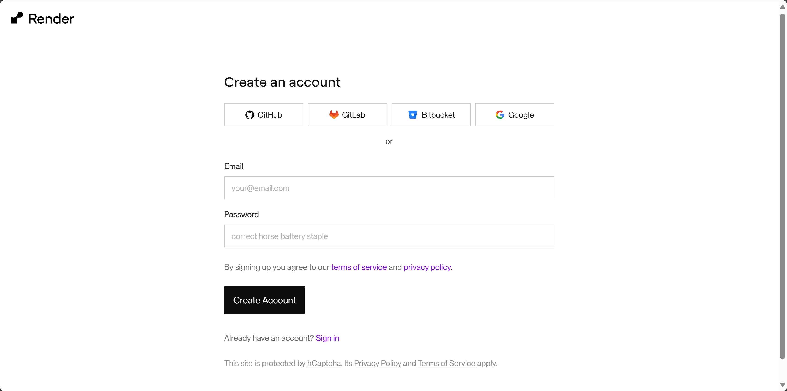
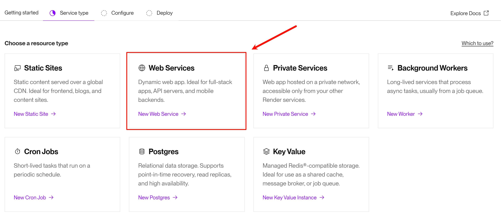
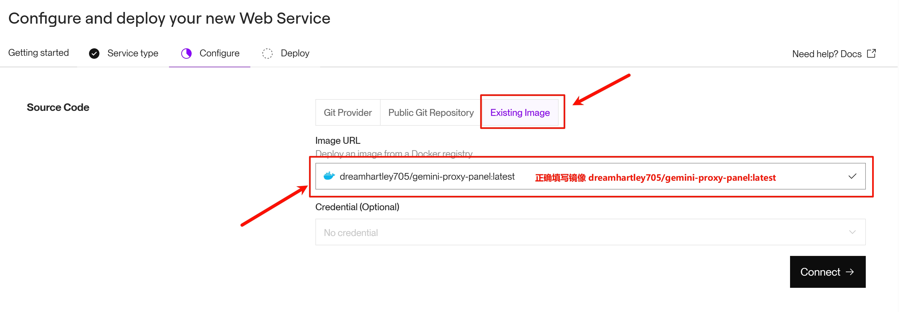
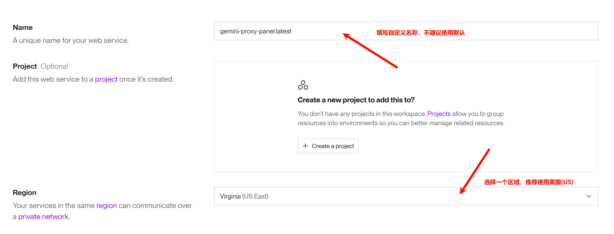
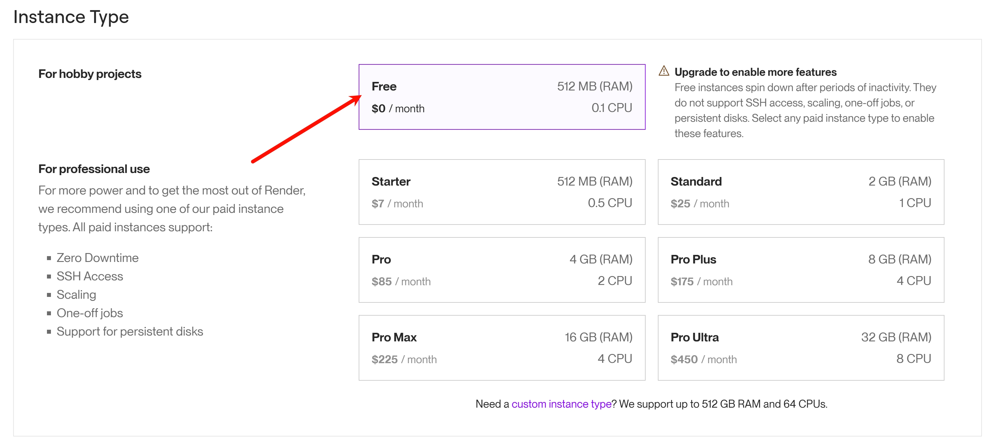
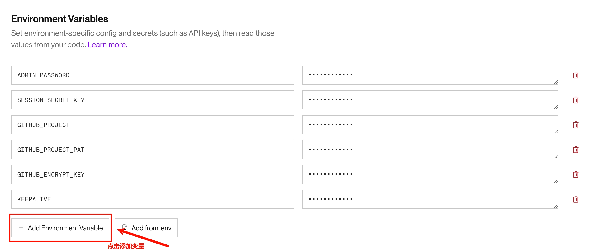
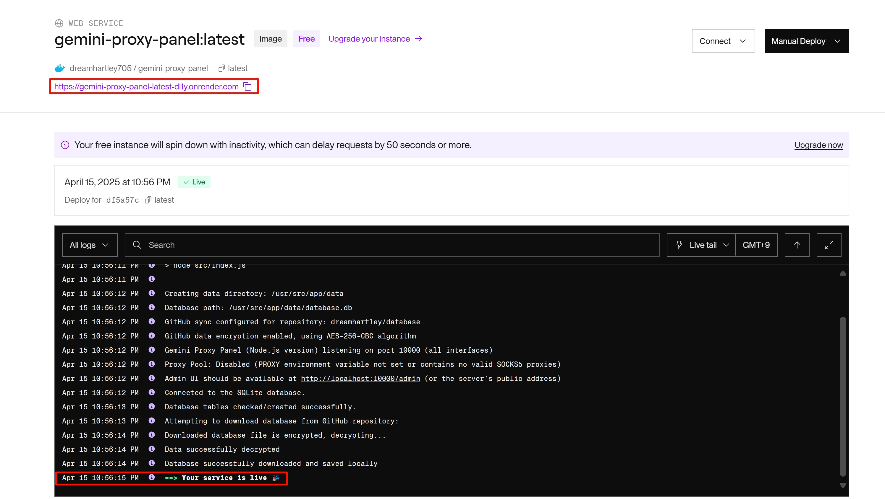

# Render 部署

此部署方式利用 Render 的 Docker 环境运行，并**强制要求启用 GitHub 同步**功能以实现数据持久化。

1. **准备 GitHub 仓库和 PAT**:
   
   * 你需要一个**自己的** GitHub 仓库来存储同步的数据。建议使用私有仓库。
   * 创建一个 GitHub Personal Access Token (PAT)，并确保勾选了 `repo` 权限范围。**请妥善保管此 Token**。
   * 具体操作步骤详见[GitHub配置同步教程](../GitHub/GitHub同步.md)

2. **在 Render 创建并部署容器**

   * 访问 [Render](https://render.com/)，点击右上角的`Get Started`按钮。
     
   * 选择一个方式创建账户，可以使用邮箱或第三方账号，例如谷歌账号登陆。
     
   * 在开始界面选择创建一个`Web Services`。
     
   * 选择`Existing Image`，在`Image URL`中填写项目的镜像。
     ```
     dreamhartley705/gemini-proxy-panel:latest
     ```
     
   * 点击`Connect`，在`Name`中填写一个自定义容器的名称，这个名称将会是访问URL的一部分，**不建议使用默认**，请自行填写。在下方选择容器的区域，推荐使用美国(US)区域。
     
   * 选择免费容器类型。
     
   * 配置环境变量，具体内容可以参考[Hugging Face Space部署](../HuggingFace/Hugging%20Face%20Space部署.md)中`配置 Space Secrets`的部分。
     <small>配置完成的示例</small>
   * 点击`Deploy web service`即可创建容器。
   * 在新页面中出现`Your service is live 🎉`表示部署成功，点击Log上方的URL即可访问容器地址。<br>
   注意，如果在创建容器时未修改镜像名称，URL将会为默认名称后添加随机字符，建议修改为自定义名称。
     
   * 后台地址为`https://xxx.onrender.com/admin`

3. **在后台中进行设置**

   * 在后台UI中进行配置 Api 连接，详细请参考[配置API连接教程](../../Usage/配置API连接.md)。

4. **Render 容器保活(可选)**

   * Render 容器将在未使用的15分钟后自动关闭，并且再次请求时自动启动，这会导致容器重启后第一次的请求时间大幅度延迟，如果您希望让容器保持运行，可以参考[配置Uptimerrobot](../Uptimerobot/配置Uptimerrobot.md)中的内容。

    > ⚠️ 注意: Render 免费容器每月有750小时的免费额度，这意味着您在同一个 Render 账号中仅可部署一个持续运行的容器。超出免费额度的使用可能会被关停容器或要求付费。
