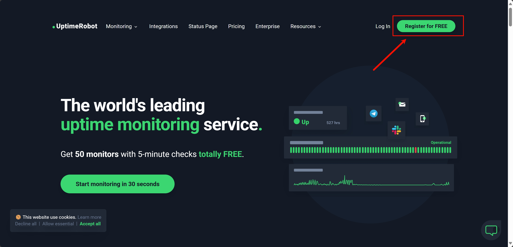
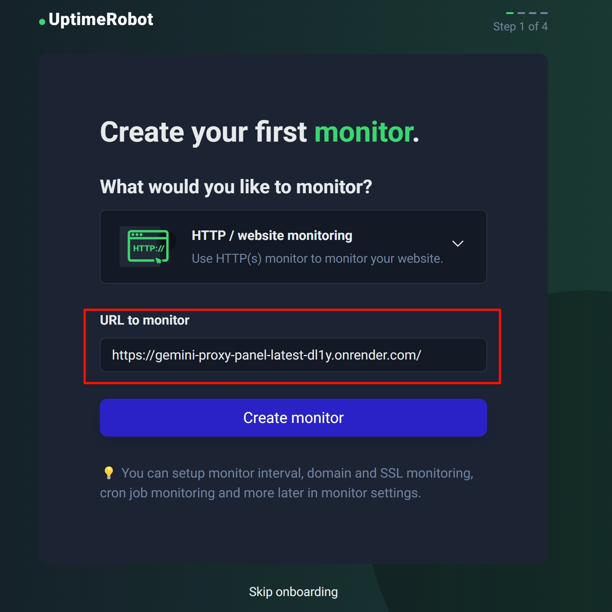
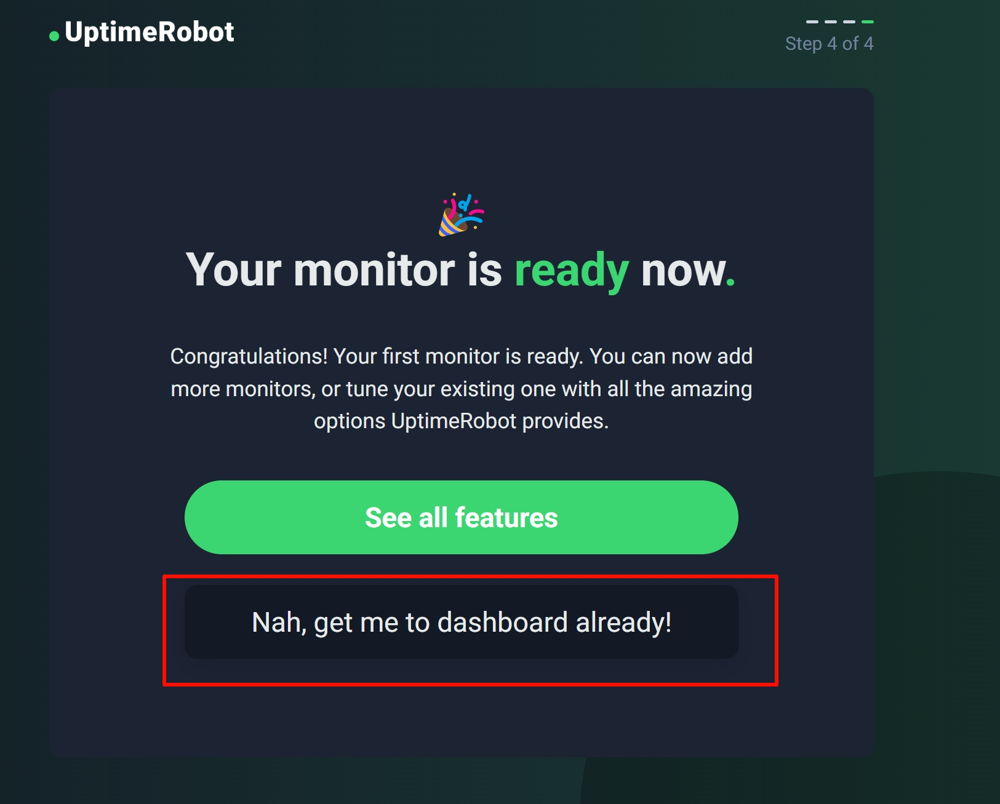

# 使用 Uptimerrobot 保活容器

1. **注册 Uptimerrobot**
   * 访问 [Uptimerrobot](https://uptimerobot.com/)，选择登陆或创建一个账号，创建账号时使用邮箱进行创建。
     
     

2. **登陆并配置 Uptimerrobot**
   * 注册并验证邮箱后可以登陆到 Uptimerrobot，如果是第一次登陆会直接提示配置监控。
   * 在`Create your first monitor`中的`URL to monitor`处填写您的容器地址（主页即可）。点击`Create monitor`。
    
   * 后续的步骤可以点击跳过(Skip)，最后点击`Nah, get me to dashboard already!`完成创建。
    

## 您已经成功配置 Uptimerrobot

免费套餐下 Uptimerrobot 会每 5 分钟访问一次配置的URL，您的容器已经实现了24小时在线运行。