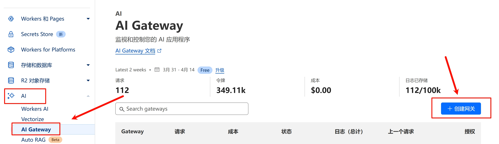
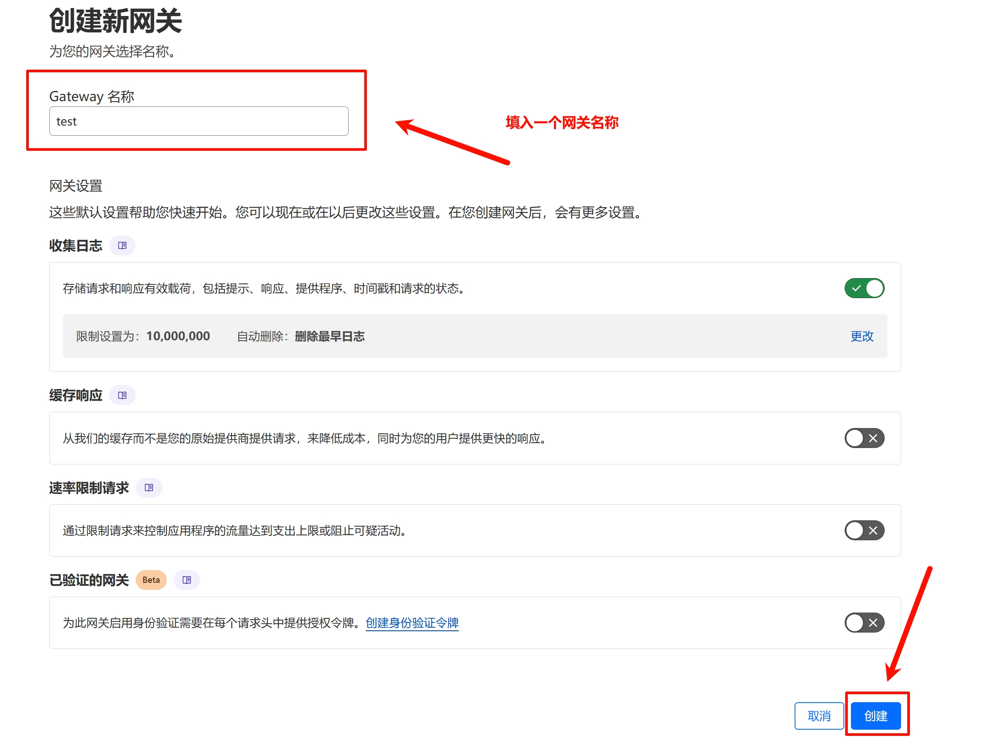
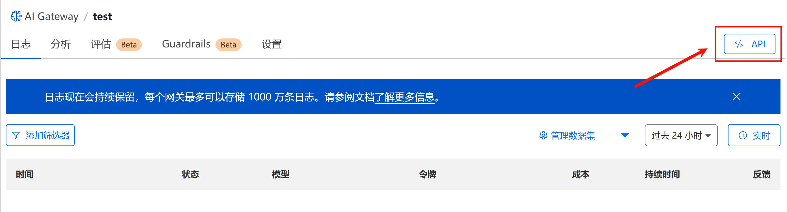

# 功能介绍: CF_GATEWAY

通过配置 `CF_GATEWAY` 环境变量，启用 Cloudflare AI Gateway 功能，用于监控、统计和转发 AI 请求。

---

## 使用方式：

### 使用项目内置默认网关地址
```
CF_GATEWAY=1
```
### 或使用自定义 Gateway 地址（推荐自定义，便于管理和监控）
```
CF_GATEWAY=https://gateway.ai.cloudflare.com/v1/your_gateway_id/your_gateway_name/
```
---

## 网关创建流程：

1. 登录 [Cloudflare Dashboard](https://dash.cloudflare.com/)，进入左侧导航栏的 `AI > AI Gateway` 页面。点击右上角的「创建网关」按钮。

2. 填写网关名称（如 test），点击「创建」。

3. 创建成功后进入详情页，点击右上角的「API」按钮。复制 API 终端地址，即网关地址，配置到项目中的 `CF_GATEWAY` 环境变量中。


---

## 注意事项：

- 使用自定义网关地址前需先在 Cloudflare 中创建网关。
- 在 Hugging Face Spaces 部署时启用该功能，可能会导致无法正常获取流式响应（streaming），请酌情使用。
- 使用项目默认提供的网关同样会记录您的请求内容，建议自行创建网关使用。
